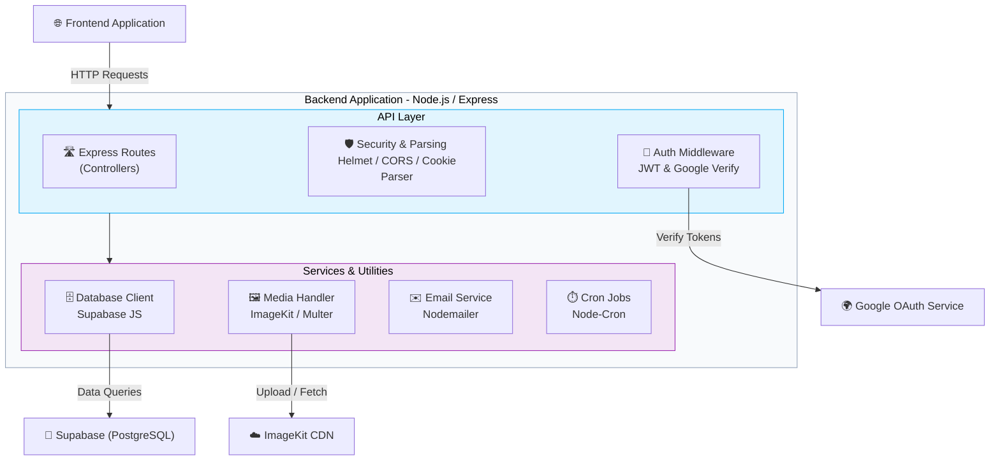

<div align="center">


# Cloud-Based Media Files Storage API

### Robust, Secure, and High-Performance Backend Infrastructure

<p align="center">
  
  
  
  
  
</p>

<p align="center">
  <a href="#-overview"><b>Overview</b></a> ·
  <a href="#-features"><b>Features</b></a> ·
  <a href="#️-tech-stack"><b>Tech Stack</b></a> ·
  <a href="#️-architecture"><b>Architecture</b></a> ·
  <a href="#️-installation--setup"><b>Quick Start</b></a>
</p>

<br/>

</div>

## 📋 Table of Contents

| | | |
|---|---|---|
| [✨ Overview](#-overview) | [🚀 Features](#-features) | [🛠️ Tech Stack](#️-tech-stack) |
| [🏗️ Architecture](#️-architecture) | [📂 Project Structure](#-project-structure) | [⚙️ Installation](#️-installation--setup) |
| [🤝 Contributing](#-contributing) | [📜 License](#-license) | [📞 Contact](#-contact) |

<br/>

## ✨ Overview

> **Cloud-Based Media Files Storage API** is the powerhouse backend infrastructure driving the media management platform.

Built with **Node.js** and **Express.js**, this backend ensures reliable data handling, secure file processing, and robust user authentication. It interfaces directly with **Supabase (PostgreSQL)** for data persistence, **ImageKit** for on-the-fly media optimization, and integrates **Google OAuth** for frictionless user authentication.

<br/>

## 🚀 Features

<table>
<tr>
<td width="33%" valign="top">

### 🔐 Security & Auth
- **Google OAuth** & JWT verification
- **Bcrypt** password hashing
- **Helmet & CORS** security headers
- **Rate limiting** for API abuse protection

</td>
<td width="33%" valign="top">

### 📁 Media & Storage
- File upload handling via **Multer**
- Image processing & delivery via **ImageKit**
- Scalable cloud storage integration

</td>
<td width="33%" valign="top">

### ⚙️ Core Infrastructure
- Persistent data layer with **Supabase**
- Email services via **Nodemailer**
- Scheduled background jobs via **Node-Cron**

</td>
</tr>
</table>

<br/>

## 🛠️ Tech Stack

### Core Technologies

| Technology | Purpose | Version |
|---|---|---|
|  | Runtime Environment | 18.x+ |
|  | Web Framework | 5.2.x |
|  | Database & Realtime API | 2.x |

### Libraries & Utilities

| Technology | Purpose |
|---|---|
|  | **jsonwebtoken**: Authentication & sessions |
|  | **google-auth-library**: Third-party auth |
|  | **imagekit** & **multer**: Media processing |
|  | **nodemailer**: Transactional emails |
|  | **node-cron**: Background task scheduling |

<br/>

## 🏗️ Architecture



<details>
<summary><b>📖 System components explained</b></summary>
<br/>

- **API Layer** — Handles incoming HTTP requests, enforces security headers with `helmet`, manages cross-origin sharing with `cors`, and protects routes with JWT-based authentication.
- **Services Layer** — Abstracts business logic, managing direct communication with **Supabase** for database queries, handling multipart file uploads via `multer`, and interfacing with **ImageKit** for external media storage.
- **Background Jobs & Mail** — Utilizes `node-cron` for scheduled system maintenance or cleanups, and `nodemailer` for dispatching transactional emails (e.g. password resets).
</details>

<br/>

## 📂 Project Structure

```
Backend/
├── 📁 src/
│   ├── 📁 config/       # Environment variables & service configurations
│   ├── 📁 controllers/  # Route handlers and core business logic
│   ├── 📁 db/           # Supabase connection & database helpers
│   ├── 📁 middlewares/  # Custom Express middlewares (Auth, Multer, etc.)
│   ├── 📁 routes/       # Express route definitions
│   ├── 📁 utils/        # Helper functions and utilities
│   └── 📄 server.js     # Express app initialization & server entry point
├── 📄 .env              # Environment variables
├── 📄 .env.example      # Example environment variables template
└── 📄 package.json      # Dependencies and scripts
```

<br/>

## ⚙️ Installation & Setup

Make sure you have the following installed before you begin:
- **Node.js** `v18+` — [Download](https://nodejs.org/)

### 🚀 Quick Start

**1. Clone the repository**
```bash
git clone https://github.com/ayanmanna123/Cloud-based-Media-Files-Storage-Backend.git
cd Cloud-based-Media-Files-Storage-Backend
```

**2. Set up environment variables**
```bash
cp .env.example .env
```
> Configure your variables (e.g., Supabase keys, JWT Secrets, ImageKit credentials).

**3. Install dependencies**
```bash
npm install
```

**4. Start the development server**
```bash
npm run dev
```
The API server will be running (usually at **http://localhost:5000** or based on your `.env` port).

### 🗄️ Database Setup (Supabase)

If you are setting up the database tables from scratch, ensure you have linked your Supabase project and applied the migrations:

**1. Login to Supabase CLI (if not already logged in)**
```bash
npx supabase login
```

**2. Initialize Supabase in the project (if not done)**
```bash
npx supabase init
```

**3. Link your Supabase Project**
```bash
npx supabase link --project-ref <your-project-ref>
```
*(You will need your database password for this step)*

**4. Create the Database Tables**
All the necessary SQL queries to create your tables, functions, and triggers are located in the `src/db/migrations/` folder. 

To apply these migrations, open your Supabase project in the browser, navigate to the **SQL Editor**, and copy-paste the contents of each `.sql` file (in numerical order) from `src/db/migrations/` to run them.

<br/>

## 🤝 Contributing

Contributions are welcome from developers of all skill levels! 🚀

1. **Fork** the repository
2. **Clone** your fork
3. **Create** a feature branch (`git checkout -b feature/amazing-feature`)
4. **Commit** your changes (`git commit -m "Add amazing feature"`)
5. **Push** to your branch (`git push origin feature/amazing-feature`)
6. **Open** a Pull Request 🎉

<br/>

## 📜 License

This project is licensed under the **MIT License**.

<br/>

## 📞 Contact

<div align="center">

### Ayan Manna 👨‍💻

<p>
<a href="https://linkedin.com/in/ayanmanna"></a>
<a href="https://twitter.com/ayanmanna"></a>
<a href="https://github.com/ayanmanna123"></a>
</p>

<br/>

**Made with ❤️ by [Ayan Manna](https://github.com/ayanmanna123) and the amazing open-source community**

</div>
